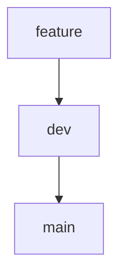

# 🧠 Psychology App

Веб-приложение для прохождения психологических тестов, анализа результатов и генерации отчётов. 
Проект разделён на `frontend` и `backend`, что позволяет фронтенду и бэкенду работать параллельно, независимо и эффективно.

---

## 📁 Структура проекта

```
psychology/
├── frontend/        # Интерфейс пользователя (React + Vite)
├── backend/         # Расчёты, логика, обработка результатов
├── .gitignore       # Исключения для Git
└── README.md        # Описание проекта (вот он)

```

---

## 🚀 Быстрый старт

### 1. 🔻 Клонирование проекта

```bash
git clone https://github.com/korotkevixh/psychology.git
cd psychology
```

### 2. 📦 Установка зависимостей

#### Frontend:
```bash
cd frontend
npm install
```

#### Backend:
```bash
cd ../backend
npm install
```

---

### 3. 🧪 Запуск проекта

#### Запуск фронтенда:
```bash
cd frontend
npm run dev
```

#### Запуск бэкенда:
```bash
cd backend
npm start
```

> 💡 По желанию можно будет настроить параллельный запуск через `concurrently` или `npm workspaces`.

---

## 🛠️ Используемые технологии

### Frontend:
- [React](https://react.dev)
- [Vite](https://vitejs.dev)
- [styled-components](https://styled-components.com)

### Backend:
- [Django Rest Framework](https://www.django-rest-framework.org/)

---

## 📌 Веточная стратегия (Git Flow)

- `main` — стабильная версия (только через pull request)
- `dev` — активная разработка
- `feature/...` — отдельные задачи



---

## 👥 Команда

| Участник      | Роль        |
|---------------|-------------|
| @korotkevixh  | Фронтенд    |
| @KornetBy     | Бэкенд      |

---

## 📬 Как вносить изменения

1. Зайди в ветку `dev`:
   ```bash
   git checkout dev
   git checkout -b feature/test_page
   ```

2. После завершения работы:
   - Пуш: `git push -u origin feature/test_page`

3. Когда `dev` будет стабилен — делаем PR в `main`
